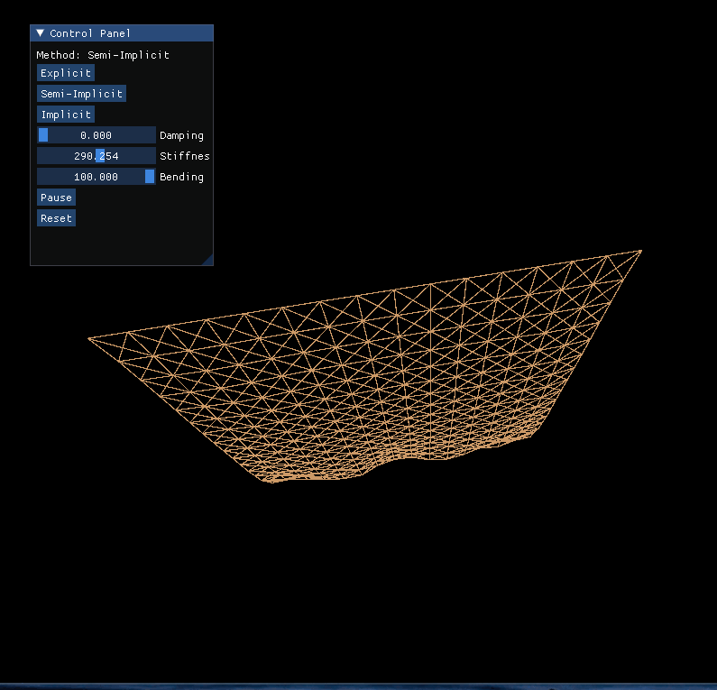

# 布料模拟 (Cloth Simulation)

基于 **Position-Based Dynamics (PBD)** 和**质点-弹簧模型**的实时布料模拟，使用 [Taichi](https://github.com/taichi-dev/taichi) 实现 GPU 加速。



## 运行

```bash
uv run python main.py
```

## 交互

### 视角控制
- **鼠标右键拖拽** — 旋转视角
- **鼠标滚轮** — 缩放

### 控制面板（右上角）

| 控制项 | 说明 |
|---|---|
| **Method** | 积分方法切换：Explicit / Semi-Implicit / Implicit |
| **Damping** | 阻尼（0 ~ 30），越大能量消耗越快 |
| **Stiffness** | 弹簧劲度系数（50 ~ 500），越大布料越硬 |
| **Bending** | 弯曲刚度（0 ~ 100），越大布料越挺 |
| **Pause / Resume** | 暂停 / 继续 |
| **Reset** | 重置初始状态 |

## 物理模型

- **网格**：16×16 质点，水平平铺展开，前边缘 (i=0) 固定
- **弹簧网络**：结构弹簧（拉伸/压缩）+ 剪切弹簧（对角线变形）+ 弯曲弹簧（隔点连接）
- **拉伸限制**：弹簧长度不超过静止长度的 1.5 倍，超出时强制修正
- **约束迭代**：每子步 5 轮位置约束投影，确保收敛

## 依赖

- Python ≥ 3.12
- Taichi ≥ 1.7.4